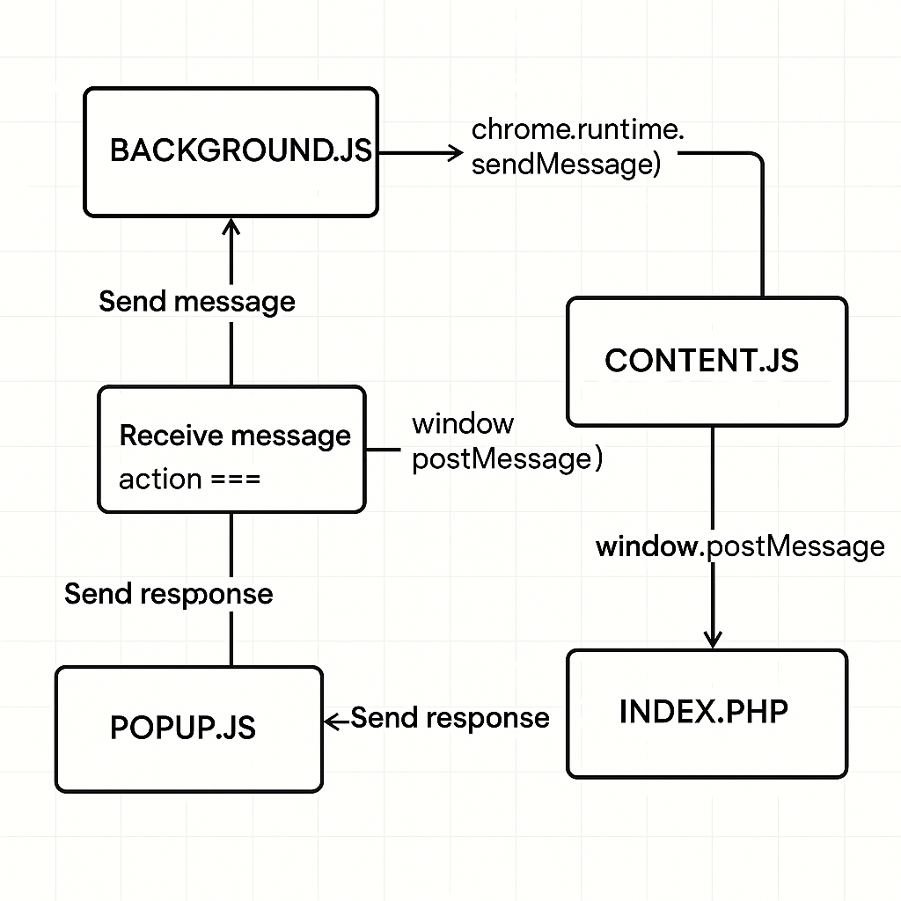

# PressID Badge Browser Plugin (aka extension)
The overview for a browser extension


## Overview


An example of direct DOM manipulation of the index.php (public facing page) from content.js (extension file),

in the **manifest.json**,
```json
...
 "content_scripts": [
        {
            "matches": [
                "<all_urls>"
            ],
            "js": [
                "scripts/content.js"
            ],
            "run_at": "document_start"
        }
    ],
...
```

in the **index.php**,
```html
<p>
  <label for="userid"><b>User ID</b></label>
  <!-- setting the field readonly, thereby only the plugin can update the field -->
  <input id="userid" name="userid" type="text" readonly required>
</p>

<script>
  window.onload = function() {
    window.postMessage({command: "GET_USER_PARAMS"}, "*");
  }
</script>
```

in the **content.js**,
```html
<script>
window.addEventListener("message", async function (event) {
  if (event.source !== window) return;
  if (!event.data || typeof event.data !== "object") return;

  if (event.data.command === "GET_USER_PARAMS") {
      // user credentials are saved in chrome storage datastore name credentials
      chrome.storage.sync.get("credentials").then(function(res, err){
        // content.js ONLY can manipulate the index.php DOM directly
        document.getElementById("userid").value = res.credentials.userid;
      }
  }
}
</script>
```

**Use Cases**
1.  Verified Identity Injection
- Purpose: Populate the field with a verified Decentralized Identifier (DID) or credential.
- Flow: Extension retrieves user's signed credential → content.js injects userid value.
- Benefit: Prevents user tampering; ensures trust in identity.
2. Single Sign-On (SSO) Binding
- Purpose: Use DID or signed ID for authenticating into external services.
- Flow: content.js fills in userid upon credential verification → backend uses it to bind sessions.
- Benefit: Seamless login experience with secure identity mapping.
3. Proof of Source for Journalism or Publishing
- Purpose: Auto-populate userid to verify authorship or claim origin.
- Flow: On content creation or claim submission, the extension populates userid with signer info.
- Benefit: Cryptographically links user to content source without manual input.
4. Role-Based Access in Platform Workflows
- Purpose: Inject roles (e.g. “publisher”, “editor”, “driver”) based on credential context.
- Flow: Extension detects role → fills userid with appropriate structured ID tag.
- Benefit: Enables server-side gating or feature toggling per role without trusting client input.
5. Credential Proof for Rideshare or Insurance Applications
- Purpose: Set userid from a credential to prefill eligibility forms.
- Flow: Extension detects and verifies credential → injects into form field.
- Benefit: Reduces fraud, simplifies user experience, and enables trust-based automation.
6. Secure Plagiarism Attribution
- Purpose: Identify the originator or verifier of AI-generated content.
- Flow: Plugin injects userid as credential signer during submission or review.
- Benefit: Creates tamper-proof audit trail and author accountability.


### 🧩 Component Contexts & Relationships

| Component       | Execution Context           | Access to `index.php` DOM | Window Access | Chrome API Access | Messaging Role |
|----------------|------------------------------|----------------------------|---------------|-------------------|----------------|
| `index.php`     | Public Web Page               | ✅ Full access             | ✅ Yes         | ❌ None            | 🟡 Receives `postMessage` from `content.js` |
| `content.js`    | Injected into `index.php`     | ✅ Full access             | ✅ Yes         | ⚠️ Limited         | 🔄 Bi-directional with `background.js` and `popup.js` |
| `background.js` | Extension Service Context     | ❌ No access               | ❌ No          | ✅ Full            | 🔄 Routing & persistent logic |
| `popup.js`      | Runs in `popup.html`          | ❌ No access               | ✅ Yes         | ⚠️ Limited         | 🔄 Receives messages from `background.js` |

### 🔀 Messaging Flow (Simplified)
Though popup.js can send messages to content.js via the window.postMessage().

```plaintext
index.php ←→ content.js ←→ background.js ←→ popup.js
          ↑               ↑                    ↓
       postMessage      sendMessage        sendMessage
```

---


### 🔁 Messaging Overview

Chrome uses an **event-driven messaging system** for communication between different parts of the extension:
- **`content.js`** runs in the context of web pages and interacts with the DOM.
- **`background.js`** runs in the background and handles long-lived tasks, centralized logic, and external events.

These two scripts can **send messages to each other** using `chrome.runtime.sendMessage` and `chrome.runtime.onMessage`.

---

### 📤 From `content.js` to `background.js`

```js
// content.js
chrome.runtime.sendMessage({ action: "fetchData", query: "userInfo" }, function(response) {
  console.log("Response from background:", response);
});
```

```js
// background.js
chrome.runtime.onMessage.addListener(function(request, sender, sendResponse) {
  if (request.action === "fetchData") {
    // Do something with request.query...
    sendResponse({ data: "Here is your data" });
  }
  return true; // Needed if sendResponse will be called asynchronously
});
```

---

### 📥 From `background.js` to `content.js`

To message a tab's content script, you need its tab ID:

```js
// background.js
chrome.tabs.query({ active: true, currentWindow: true }, function(tabs) {
  chrome.tabs.sendMessage(tabs[0].id, { action: "highlightText" }, function(response) {
    console.log("Received from content:", response);
  });
});
```

```js
// content.js
chrome.runtime.onMessage.addListener(function(request, sender, sendResponse) {
  if (request.action === "highlightText") {
    // Perform DOM manipulation
    sendResponse({ success: true });
  }
});
```

---

### 🔒 Security Considerations

Since you’re laser-focused on CSP and secure workflows, remember:
- Always **validate incoming messages** to prevent abuse or spoofing.
- Avoid passing sensitive data unless using secure channels.
- Consider **Manifest V3 service worker context** if transitioning from traditional background pages.

---

## Training
[Build a Chrome Extension – Course for Beginners](https://www.youtube.com/watch?v=0n809nd4Zu4)

