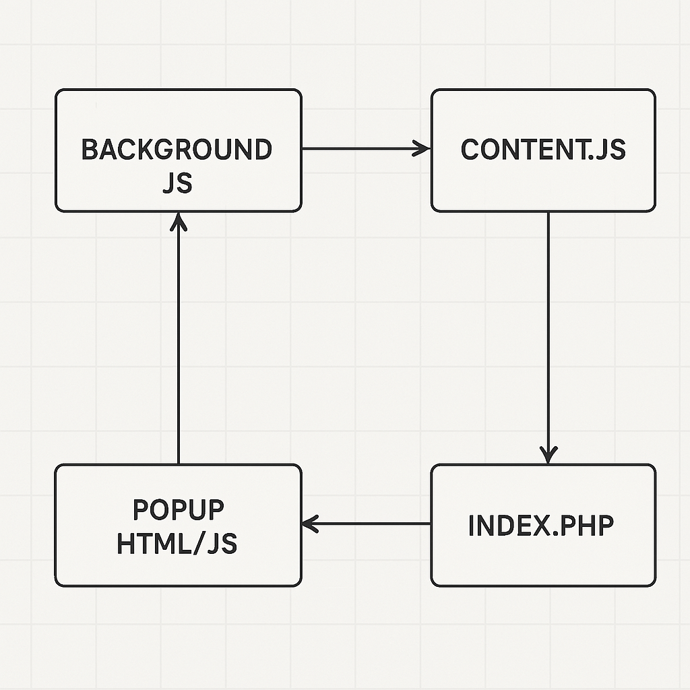

# PressID Badge Browser Plugin (aka extension)
The overview for a browser extension

## Overview


Absolutely! Messaging between `background.js` and `content.js` is essential in Chrome extensions to enable coordinated behavior across components. Here's a breakdown of how they communicate 👇

---

### 🔁 Messaging Overview

Chrome uses an **event-driven messaging system** for communication between different parts of the extension:
- **`content.js`** runs in the context of web pages and interacts with the DOM.
- **`background.js`** runs in the background and handles long-lived tasks, centralized logic, and external events.

These two scripts can **send messages to each other** using `chrome.runtime.sendMessage` and `chrome.runtime.onMessage`.

---

### 📤 From `content.js` to `background.js`

```js
// content.js
chrome.runtime.sendMessage({ action: "fetchData", query: "userInfo" }, function(response) {
  console.log("Response from background:", response);
});
```

```js
// background.js
chrome.runtime.onMessage.addListener(function(request, sender, sendResponse) {
  if (request.action === "fetchData") {
    // Do something with request.query...
    sendResponse({ data: "Here is your data" });
  }
  return true; // Needed if sendResponse will be called asynchronously
});
```

---

### 📥 From `background.js` to `content.js`

To message a tab's content script, you need its tab ID:

```js
// background.js
chrome.tabs.query({ active: true, currentWindow: true }, function(tabs) {
  chrome.tabs.sendMessage(tabs[0].id, { action: "highlightText" }, function(response) {
    console.log("Received from content:", response);
  });
});
```

```js
// content.js
chrome.runtime.onMessage.addListener(function(request, sender, sendResponse) {
  if (request.action === "highlightText") {
    // Perform DOM manipulation
    sendResponse({ success: true });
  }
});
```

---

### 🔒 Security Considerations

Since you’re laser-focused on CSP and secure workflows, remember:
- Always **validate incoming messages** to prevent abuse or spoofing.
- Avoid passing sensitive data unless using secure channels.
- Consider **Manifest V3 service worker context** if transitioning from traditional background pages.

---

## Training
[Build a Chrome Extension – Course for Beginners](https://www.youtube.com/watch?v=0n809nd4Zu4)

