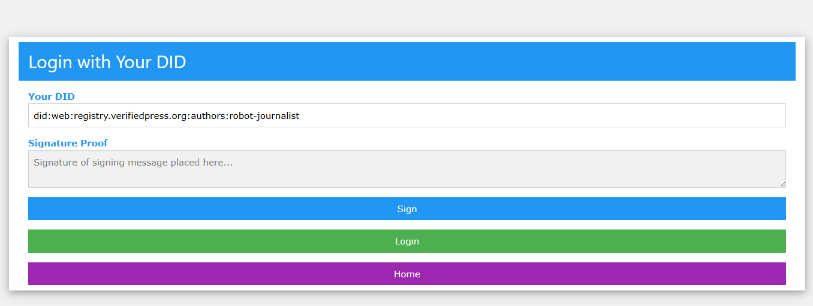
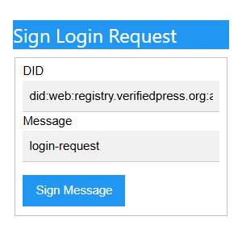
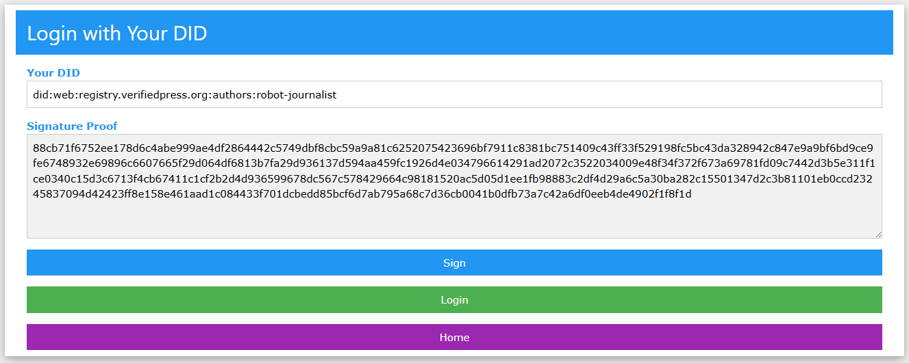

# Edge Browser Extension
The Edge Extension for accesing verifiedpress.org. See [chrome](../chrome/README.md) about Chrome Extensions.

[Microsoft Edge Extension Developer](https://learn.microsoft.com/en-us/microsoft-edge/extensions/landing/)

## Quickstart
 After installing the extension, visit [verifiedpress.org](https://verifiedpress.org), and the following popup will appear,
 
 
 
 You will need the Verified Press CLI tool, available from ```npm install -g @verifiedpress/verifiedpress-cli```,
 
 then begin the onboarding by using the Verified Press CLI tool, ```vp init```,
 
 in your user home directory, you will see an identity directory containing an **identity.json** file, you will need to copy the **DID** identified as ID in the **identify.json** and then open the **private.key-1.pem** anc copy the private key, then paste in the extension dialog.
 
 you will see your DID populated on the login page,
 
 
 
 now you can sign a preset message by pressing the **Sign** button above,
 
 
 
 then press the **Sign Message** button and the Signature will be populated,
 
 
 
 now can login
 