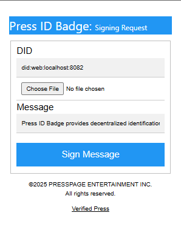
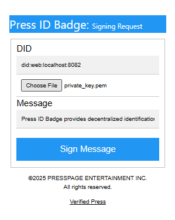
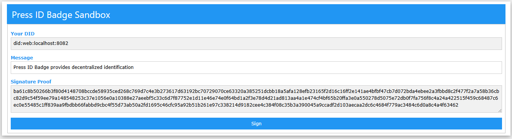

# 🧪 Sandbox for Testing
The Press ID Badge extension was originally designed to support decentralized identities for authors and journalists, enabling them to establish clear ownership of newsworthy content. Beyond content attribution, this extension also functions as a decentralized Single Sign-On (SSO) system—providing a secure alternative to traditional username-password authentication.

The public/ directory in this repository serves as a testbed for:
- ✅ Verifying the browser extension’s installation and messaging workflow.
- 🔐 Evaluating authentication flows powered by Verifiable Credentials and DIDs.
- 🧬 Prototyping different login implementations using the extension as an SSO layer.
Decentralized identities used with this extension can be created using:
- [Veramo](https://veramo.io/), a pluggable framework for DID and VC management.
- VerifiedPress CLI — install via ```npm i @verifiedpress/verifiedpress-cli``` to issue, inspect, and validate credentials aligned with VerifiedPress.org (or used on your own verification platform).
This sandbox is ideal for testing across multiple origins, simulating credential issuance and selective disclosure, and validating login logic without coupling to centralized identity providers.


## Quickstart
1. Install the [PHP CLI](https://php.net), make sure php executable is int your path.
2. Clone this repository and change to the public/ directory
3. Start the PHP development server from this directory, ```php -S localhost:8082 -t .```
4. Open your selected browser to [locahost](http://localhost:8082)
5. Add the unpacked extension to your browser (disabled the app store version, if you already installed the extension from the app store)
6. Refresh your browser to show


7. Using the sample decentralized identity (DiD) in [did.json](.well-known/did.json), which is **did:web:localhost:8082** to enter for the DID in the popup.

8. Upon saving the DiD is populated in the index.php page (*if the DID field doesn't populate, just reload the browser*),


9. Enter a message to be signed in the entry field,


10. Now you can sign the message by selecting the private key file and pressing the **Sign** button above,



11. Choose your private key PEM file,


12. Press the **Sign Message** button,



13. The Signature will be populated,



now can you can process the **DiD** and **Signature** for your login logic?

14. Adding an authenticate.php file to process with a submit button on the index.php,


15. The remote copy of the public_key.pem is used to verify the signature against the message,


with an updated verification confirmation,


16. Using a custom **JwkVerifier** class, that can verify a JWK without using openssl_* functions to verify a JWK against a signature and message,


17. The verification confirmation for JWK,


**NOTE**: in the *.well-known/did.json*, the ~JWK and~ Public Key has been replaced with a public link for the public_key.pem certificate, as the openssl_verify will fail when the public_key is passed as a string or decoded from a JWK, but works when file_get_contents(<URL>) is being used. The JWK has been added back under the index of "jwk" and the public key referenced using the index of "key."

## Overview


An example of direct DOM manipulation of the index.php (public facing page) from content.js (extension file),

in the **manifest.json**,
```json
...
 "content_scripts": [
        {
            "matches": [
                "<all_urls>"
            ],
            "js": [
                "scripts/content.js"
            ],
            "run_at": "document_start"
        }
    ],
...
```

in the **index.php** (*publicly hosted or using ```php -S localhost:8080 -t index.php```*),
```html
<p>
  <label for="userid"><b>User ID</b></label>
  <!-- setting the field readonly, thereby only the plugin can update the field -->
  <input id="userid" name="userid" type="text" readonly required>
</p>

<script>
  window.onload = function() {
    window.postMessage({command: "GET_USER_PARAMS"}, "*");
  }
</script>
```

in the **content.js**,
```html
<script>
window.addEventListener("message", async function (event) {
  if (event.source !== window) return;
  if (!event.data || typeof event.data !== "object") return;

  if (event.data.command === "GET_USER_PARAMS") {
      // user credentials are saved in chrome storage datastore name credentials
      chrome.storage.sync.get("credentials").then(function(res, err){
        // content.js ONLY can manipulate the index.php DOM directly
        document.getElementById("userid").value = res.credentials.userid;
      }
  }
}
</script>
```

**Use Cases for READONLY INPUT field**
1. **Verified Identity Injection**
- **Purpose**: *Populate the field with a verified Decentralized Identifier (DID) or credential.*
- **Flow**: *Extension retrieves user's signed credential → content.js injects userid value.*
- **Benefit**: *Prevents user tampering; ensures trust in identity.*
2. **Single Sign-On (SSO) Binding**
- **Purpose**: *Use DID or signed ID for authenticating into external services.*
- **Flow**: *content.js fills in userid upon credential verification → backend uses it to bind sessions.*
- **Benefit**: *Seamless login experience with secure identity mapping.*
3. **Proof of Source for Journalism or Publishing**
- **Purpose**: *Auto-populate userid to verify authorship or claim origin.*
- **Flow**: *On content creation or claim submission, the extension populates userid with signer info.*
- **Benefit**: *Cryptographically links user to content source without manual input.*
4. **Role-Based Access in Platform Workflows**
- **Purpose**: *Inject roles (e.g. “publisher”, “editor”, “driver”) based on credential context.*
- **Flow**: *Extension detects role → fills userid with appropriate structured ID tag.*
- **Benefit**: *Enables server-side gating or feature toggling per role without trusting client input.*
5. **Credential Proof for Rideshare or Insurance Applications**
- **Purpose**: *Set userid from a credential to prefill eligibility forms.*
- **Flow**: *Extension detects and verifies credential → injects into form field.*
- **Benefit**: *Reduces fraud, simplifies user experience, and enables trust-based automation.*
6. **Secure Plagiarism Attribution**
- **Purpose**: *Identify the originator or verifier of AI-generated content.*
- **Flow**: *Plugin injects userid as credential signer during submission or review.*
- **Benefit**: *Creates tamper-proof audit trail and author accountability.*


### 🧩 Component Contexts & Relationships

| Component       | Execution Context           | Access to `index.php` DOM | Window Access | Chrome API Access | Messaging Role |
|----------------|------------------------------|----------------------------|---------------|-------------------|----------------|
| `index.php`     | Public Web Page               | ✅ Full access             | ✅ Yes         | ❌ None            | 🟡 Receives `postMessage` from `content.js` |
| `content.js`    | Injected into `index.php`     | ✅ Full access             | ✅ Yes         | ⚠️ Limited         | 🔄 Bi-directional with `background.js` and `popup.js` |
| `background.js` | Extension Service Context     | ❌ No access               | ❌ No          | ✅ Full            | 🔄 Routing & persistent logic |
| `popup.js`      | Runs in `popup.html`          | ❌ No access               | ✅ Yes         | ⚠️ Limited         | 🔄 Receives messages from `background.js` |

### 🔀 Messaging Flow (Simplified)
Though popup.js can send messages to content.js via the window.postMessage().

```plaintext
index.php ←→ content.js ←→ background.js ←→ popup.js
          ↑               ↑                    ↓
       postMessage      sendMessage        sendMessage
```

# Developing with Press ID Badge Extension
The **Press ID Badge** extension provides the mechanics to sign a message with a private key and then set a DOM object id with that signature. The minimum configuration for a public facing page with **Press ID Badge** extension are one input or hidden fields (*with value attribute*) with the assigned id's of "did", case-sensitive, and a message listener for the "SIGNATURE_READY" event.

The "did" element represents the Decentralized Identification obtain from the .well-know/did.json document and saved in chrome.storage, the signature is sent back to the public facing page via the message event of "SIGNATURE_READY".

```html
<input type="text" id="did">
```

create a message listener,

```html
window.addEventListener("message", async function (e) {
    if (!e.data || typeof e.data !== "object") return;

    console.log(e);

    if (e.data.type === "SIGNATURE_READY") {
        const { signature } = e.data;
        console.log(signature);
        // process the signature
        document.getElementById("proof").value = signature.signature;
    }
});
```

# ⚠️ Development Key Disclaimer

> **IMPORTANT**  
> The public and private keys provided in this repository are strictly for **evaluation and development purposes only**.  
> These keys are **not secure** and **must not** be used in any production, public-facing, or identity-critical environment.  
>  
> Any misuse may expose your application to serious cryptographic vulnerabilities.  
>  
> 🛡️ For real-world deployments, always generate fresh key pairs using industry-approved methods and manage them securely.

