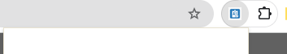
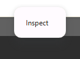
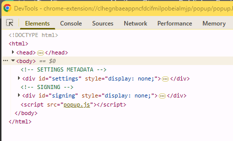
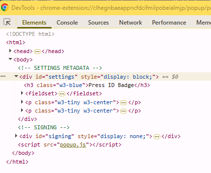
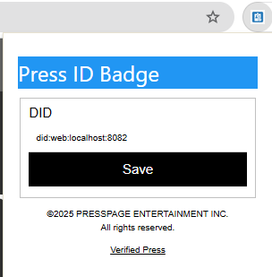

# Issues
The following issues pertains **ONLY** to the chrome extension.

## v1.0.1

### No popup dialog after installing the extension and clicking the browser button

**Temporary Fix**
1. right-click to inspect

2. view th HTML element and expand the body tag

3. change the **display: none;** to **display: block;** for the id="settings" block

4. the popup will show

**How you can help**
1. fork this repository
2. review the source code and look for the cause
3. identity the fix
4. test the fix
5. check in your changes to your fork
6. submit a pull request