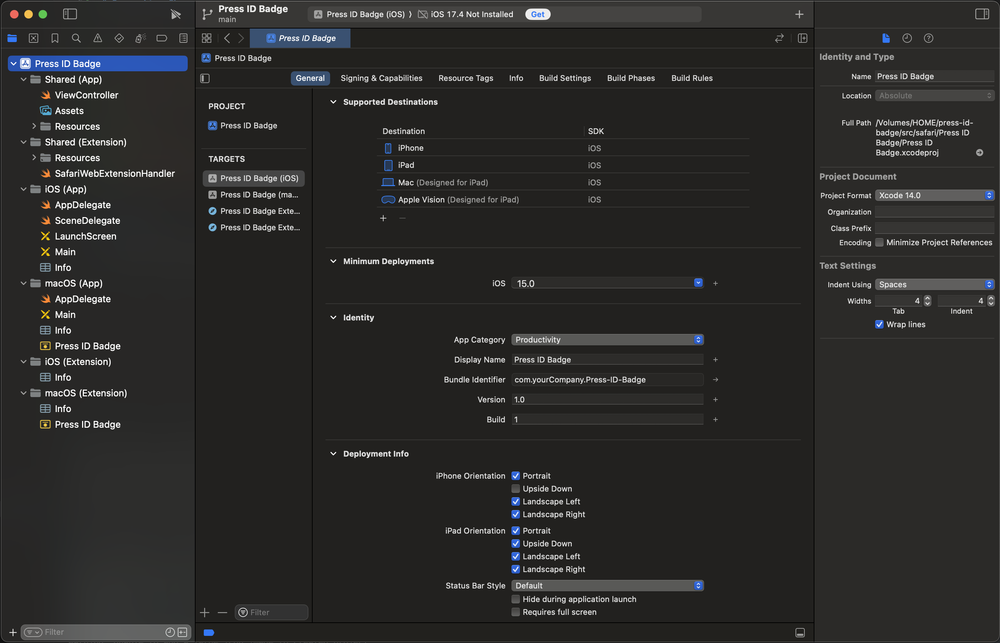
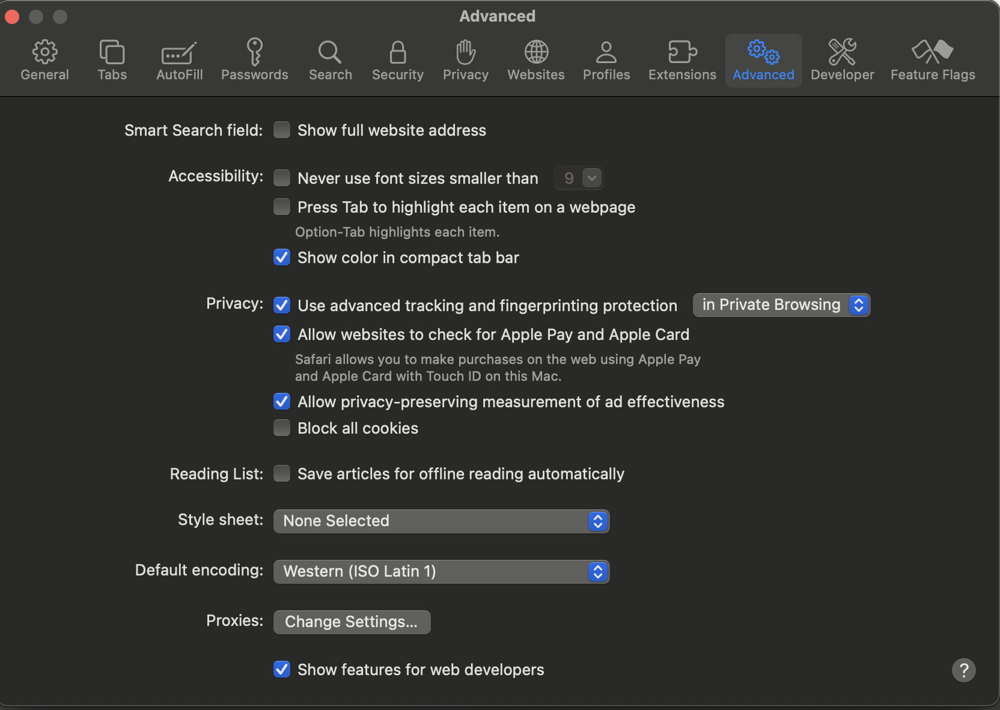
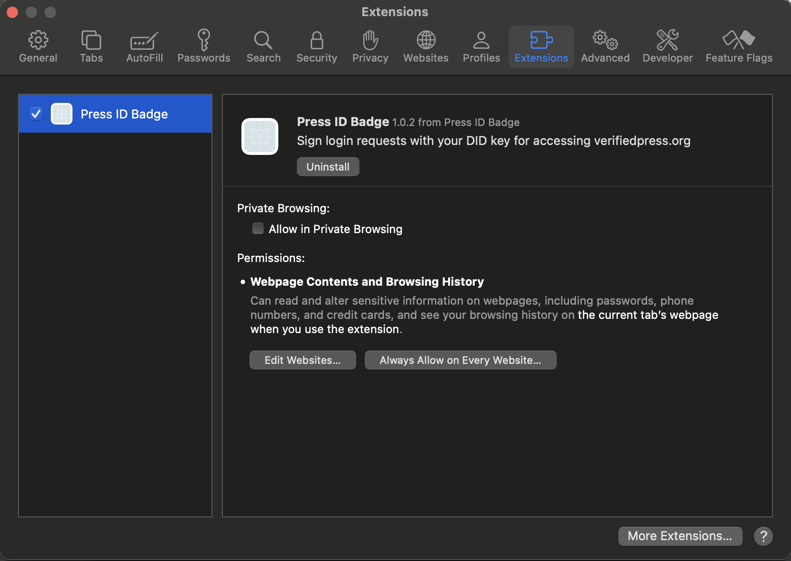
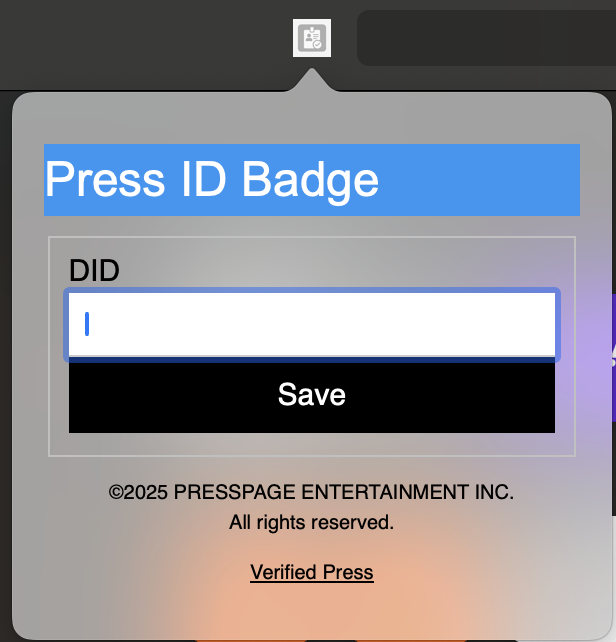
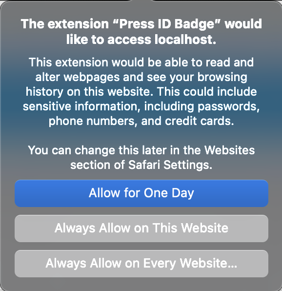
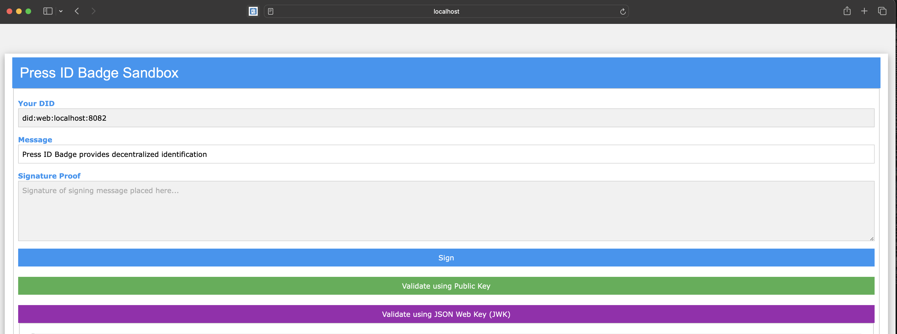
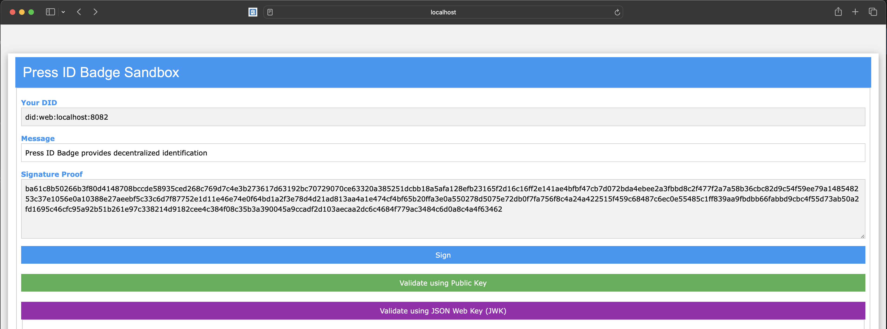
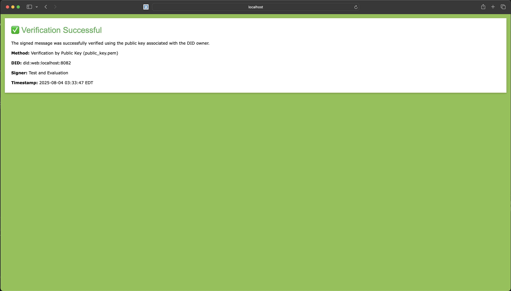
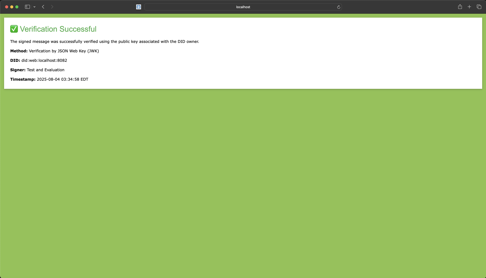

# Safari Browser Extension
For MacOSX-**ONLY**

[Creating an Extension](https://developer.apple.com/documentation/safariservices/creating-a-safari-web-extension)

# Converting Chrome
[Converting Chrome extension to Safari](https://bartsolutions.github.io/2020/11/20/safari-extension/)

```sh
cd src/safari
xcrun safari-web-extension-converter ../chrome
Xcode Project Location: ./press-id-badge/src/safari
App Name: Press ID Badge
App Bundle Identifier: com.yourCompany.Press-ID-Badge
Platform: All
Language: Swift
Warning: Unable to add icons to created project:
Error Domain=SafariWebExtensionConverterErrorDomain Code=-1 "manifest.json is missing icons" UserInfo={NSLocalizedDescription=manifest.json is missing icons}
Warning: Unable to add a large icon image to created project:
Error Domain=SafariWebExtensionConverterErrorDomain Code=-1 "manifest.json is missing a large icon size" UserInfo={NSLocalizedDescription=manifest.json is missing a large icon size}
```

from XCode,



set the caregory to **Productivity**.

launch safaru and navigate to safari -> settings -> advancedm and check **Show features for web develoeprs**



then switch to the Developer tab, and check **Allow unassigned extensions**



change to the extension tab and check the **Press ID Badge** extension to enable



you may need to grant permissions



start PHP
```sh
cd ../../public
php -S localhost:8082 -t .
```

then open safari browser to [http://localhost:8082](http://localhost:8082)



then press **Sign** to sign the message with the local private key,


copy and paste the **private_key.pem** in the Private Key field above and press **Sign Message** button,



now you can verify with the public_key.pem on github.com,



and verify with the JWK,



# Releases
- 1.0.2 WIP
- 1.0.1 not released
- 1.0.0 not released
